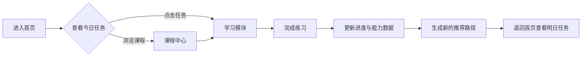

# KET 探索星球 — 产品需求文档

## 1. 产品概述

KET 探索星球是一款面向小学阶段的沉浸式在线英语学习平台，以剑桥 KET（Key English Test）能力模型为核心目标，通过游戏化探索主题帮助学生建立扎实的听说读写基础。平台将词汇、语法、口语、听力四大模块融入分级课程，配合实时进度追踪与智能路径推荐，让备考 KET 的过程像闯关探险一样有趣。

## 2. 核心功能

### 2.1 用户角色

| 角色 | 注册/登录方式 | 核心权限 |
|------|--------------|----------|
| 学生 | 游客模式（本地存储进度，无需登录） | 学习课程、完成练习、查看进度、接收推荐 |

### 2.2 功能模块

1. **首页（Dashboard）**：学习概览、今日任务、连续学习天数、快捷入口。
2. **课程中心（Courses）**：分级课程体系展示，按级别解锁学习单元；每个单元内置基础语法讲解卡片。
3. **学习模块（Learn）**：单词记忆、语法练习、口语跟读、听力训练四大互动练习。
4. **学习进度（Progress）**：能力雷达图、单元完成率、学习时长、错题回顾。
5. **我的路径（My Path）**：基于学习数据生成的个性化推荐路线与每日目标。

### 2.3 页面详情

| 页面 | 模块 | 功能描述 |
|------|------|----------|
| 首页 | 今日任务卡 | 展示当天推荐的 3 项学习任务，支持一键进入 |
| 首页 | 学习数据概览 | 显示连续学习天数、已掌握单词数、本周学习时长 |
| 首页 | 快捷入口 | 跳转到课程中心、学习模块、进度、我的路径 |
| 课程中心 | 级别导航 | Starter / Mover / Flyer / KET 预备四个级别 |
| 课程中心 | 单元卡片 | 每个级别包含 6-8 个单元，显示完成状态与星级 |
| 课程中心 | 语法讲解 | 每个单元配置 1-3 个基础语法点，以图文/例句形式讲解 |
| 单元详情 | 语法卡片 | 语法点标题、讲解说明、典型例句、常见错误提示 |
| 学习模块 | 单词记忆 | 卡片翻转、发音朗读、掌握/生疏标记 |
| 学习模块 | 语法练习 | 选择题形式，实时判断并解析 |
| 学习模块 | 口语跟读 | 展示例句、播放原音、录音按钮（模拟评分反馈） |
| 学习模块 | 听力训练 | 播放音频、选择正确图片/句子 |
| 学习进度 | 能力雷达 | 听力、口语、阅读、写作、语法五维能力展示 |
| 学习进度 | 成就徽章 | 完成特定目标后解锁徽章 |
| 我的路径 | 推荐路线 | 根据弱项自动生成下一步学习建议 |
| 我的路径 | 每日目标 | 可调整的每日单词/练习目标 |

## 3. 核心流程

学生进入首页后查看今日任务，点击任务进入对应学习模块；完成练习后系统记录得分并更新能力数据。学生也可在课程中心按级别选择单元学习，或在“我的路径”中查看基于历史表现的个性化推荐。所有进度保存在浏览器本地存储，刷新页面后自动恢复。

## 4. 用户界面设计

### 4.1 设计风格

- **主题方向**：太空探索 / 童趣玩具风。将学习过程比喻为“驾驶飞船探索语言星球”。
- **主色**：深空蓝 `#1A1F4B` 作为背景基底，星云紫 `#7B61FF` 与恒星黄 `#FFD166` 作为强调色。
- **辅助色**：薄荷绿 `#06D6A0` 表示正确/完成，珊瑚红 `#EF476F` 表示错误/重点。
- **按钮风格**：大圆角胶囊按钮（`rounded-full`），带有轻微阴影与悬浮缩放。
- **字体**：标题使用圆润活泼的 `Fredoka`（或类似展示字体），正文使用清晰易读的 `Nunito`。
- **布局风格**：卡片式布局，充足留白，大字号友好呈现，适合儿童阅读与操作。
- **图标/插画**：使用 emoji 与简洁几何图形结合（如 🚀、🪐、⭐、🎧、🎤），避免复杂插画依赖。

### 4.2 页面设计概览

| 页面 | 模块 | UI 元素 |
|------|------|---------|
| 首页 | 顶部欢迎区 | 宇航员头像、用户名、连续学习火焰图标 |
| 首页 | 数据概览 | 三个统计卡片：连续天数、掌握单词、本周时长 |
| 首页 | 今日任务 | 横向任务列表，每张卡片带模块图标与进度条 |
| 课程中心 | 级别切换 | 胶囊分段控制器，选中态带发光效果 |
| 课程中心 | 单元网格 | 星球形状的单元节点，连线表示解锁路径 |
| 单元详情 | 语法卡片 | 左侧彩色图标，右侧标题、讲解、例句与提示 |
| 学习模块 | 模块选择 | 四宫格大卡片，图标 + 标题 + 简短描述 |
| 单词记忆 | 卡片区域 | 3D 翻转卡片，正面英文单词，背面中文释义与例句 |
| 语法练习 | 题目区 | 题目文本 + 四个选项按钮，选中后即时反馈 |
| 口语跟读 | 录音区 | 例句展示 + 播放按钮 + 麦克风录音按钮 + 模拟评分星标 |
| 听力训练 | 音频区 | 播放按钮 + 三个图片/文字选项卡片 |
| 学习进度 | 雷达图 | SVG 五维雷达图，动画填充 |
| 学习进度 | 成就墙 | 徽章网格，未解锁为灰度半透明 |
| 我的路径 | 路线图 | 垂直时间线，展示推荐学习步骤 |

### 4.3 响应式

- 桌面端优先，最大内容宽度 `1200px`。
- 平板端：课程网格由 4 列变为 2 列，侧边导航改为底部标签栏。
- 移动端：单列布局，按钮与卡片尺寸放大以方便儿童手指点击。

## 5. 非功能需求

- **性能**：首屏加载时间 < 2 秒，图片与音频资源懒加载。
- **可访问性**：按钮与链接有清晰的 focus 状态，关键操作支持键盘操作。
- **离线能力**：学习进度使用 `localStorage` 持久化，核心页面无需网络即可使用。
- **数据安全**：不涉及真实用户信息，游客模式数据仅保存在本地。
