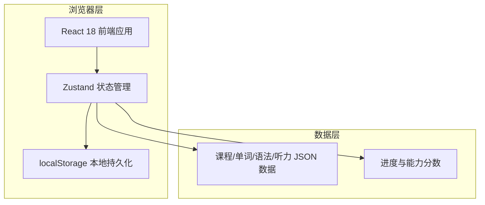
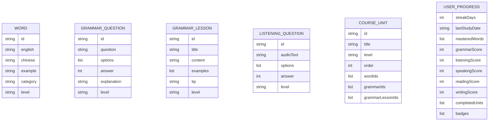

# KET 探索星球 — 技术架构文档

## 1. 架构设计



本项目为纯前端应用，无需后端服务。所有课程数据以静态 JSON 形式内置，用户学习进度保存在浏览器 `localStorage` 中，确保游客即可使用。

## 2. 技术选型

- **前端框架**：React 18 + TypeScript
- **构建工具**：Vite
- **样式方案**：Tailwind CSS 3
- **路由**：React Router DOM 6
- **状态管理**：Zustand
- **图标库**：lucide-react
- **字体**：Google Fonts（Fredoka + Nunito）
- **数据持久化**：localStorage

## 3. 路由定义

| 路由 | 用途 |
|------|------|
| `/` | 首页（Dashboard） |
| `/courses` | 课程中心，展示分级课程 |
| `/learn` | 学习模块入口，选择单词/语法/口语/听力 |
| `/learn/vocabulary` | 单词记忆练习 |
| `/learn/grammar` | 语法练习 |
| `/learn/speaking` | 口语跟读练习 |
| `/learn/listening` | 听力训练 |
| `/progress` | 学习进度与成就 |
| `/path` | 我的个性化学习路径 |

## 4. API 定义

由于本项目为纯前端应用，无后端 API。数据通过以下方式提供：

- 课程、单词、语法、听力题目均以内置 TypeScript 类型与 JSON 数据提供。
- Zustand store 提供统一的数据读取与写入接口。

核心数据类型示例：

```typescript
type WordCategory = 'school' | 'family' | 'food' | 'animals' | 'colors' | 'numbers' | 'clothes' | 'weather';

interface Word {
  id: string;
  english: string;
  chinese: string;
  example: string;
  category: WordCategory;
  level: 'starter' | 'mover' | 'flyer' | 'ket';
}

interface GrammarQuestion {
  id: string;
  question: string;
  options: string[];
  answer: number;
  explanation: string;
  level: Level;
}

interface GrammarLesson {
  id: string;
  title: string;
  content: string;
  examples: string[];
  tip?: string;
  level: Level;
}

interface UserProgress {
  streakDays: number;
  lastStudyDate: string;
  masteredWords: string[];
  grammarScore: number;
  listeningScore: number;
  speakingScore: number;
  readingScore: number;
  writingScore: number;
  completedUnits: string[];
  badges: string[];
}
```

## 5. 数据模型

### 5.1 ER 图



### 5.2 初始数据

- 每个级别预置 6-8 个课程单元。
- 词汇库包含 400-450 个高频基础词，覆盖校园、家庭、食物、动物、颜色、数字、服饰、天气八大类别。
- 每个单元包含 8-12 个单词、5-8 道语法题、3-5 道听力题。
- 每个单元配置 1-3 个基础语法讲解点（GrammarLesson），涵盖人称代词、物主代词、名词单复数、可数/不可数名词、be 动词、SVO 句型、一般现在时、时间状语、基础介词等。
- 口语跟读使用单元内例句作为练习素材。
- 用户进度初始化为默认值，首次进入时自动创建。

## 6. 项目结构

```
/workspace
├── .trae/documents/       # 需求与架构文档
├── public/                # 静态资源
├── src/
│   ├── components/        # 通用组件
│   ├── pages/             # 页面组件
│   ├── stores/            # Zustand 状态管理
│   ├── data/              # 课程、题目等静态数据
│   ├── types/             # TypeScript 类型定义
│   ├── utils/             # 工具函数
│   ├── App.tsx
│   └── main.tsx
├── index.html
├── package.json
├── tailwind.config.js
├── tsconfig.json
└── vite.config.ts
```

## 7. 关键实现说明

- **进度持久化**：Zustand store 初始化时读取 `localStorage`，状态变化时自动写入。
- **个性化推荐**：根据能力雷达图中最低分项，优先推荐对应模块的下一级别内容。
- **连续学习天数**：每次进入应用时对比 `lastStudyDate`，若与今天相差 1 天则累加，超过 1 天则重置。
- **成就徽章**：在进度 store 中定义徽章触发条件，条件达成时自动解锁。
